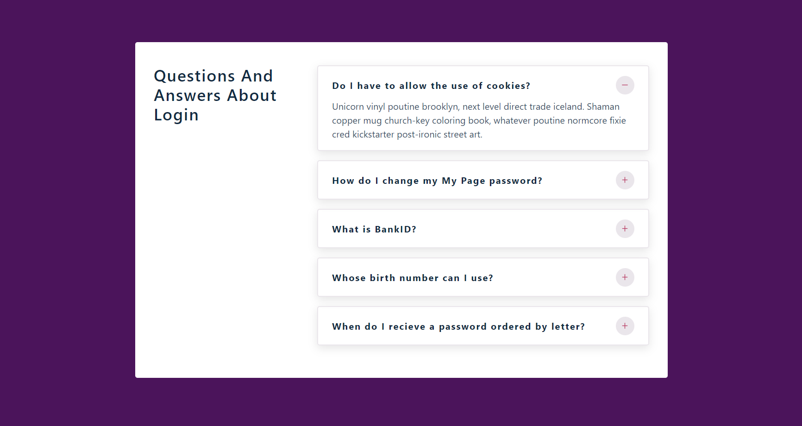

# Accordion React App

---
## Description
- Data is taken from Data.js in src folder and is destructured to display title and info.
- On clicking the icon on the right, info is visible and also the icon changes, and similarly, on clicking again info is not visible and icon changes again.

---
## Packages
### `React icon package`
Go to link [https://react-icons.github.io/react-icons](https://react-icons.github.io/react-icons)

Or install using terminal by running "npm install react-icons --save" inside the react project.

In this project, AiOutlineMinus and AiOutlinePlus icons are used.

---